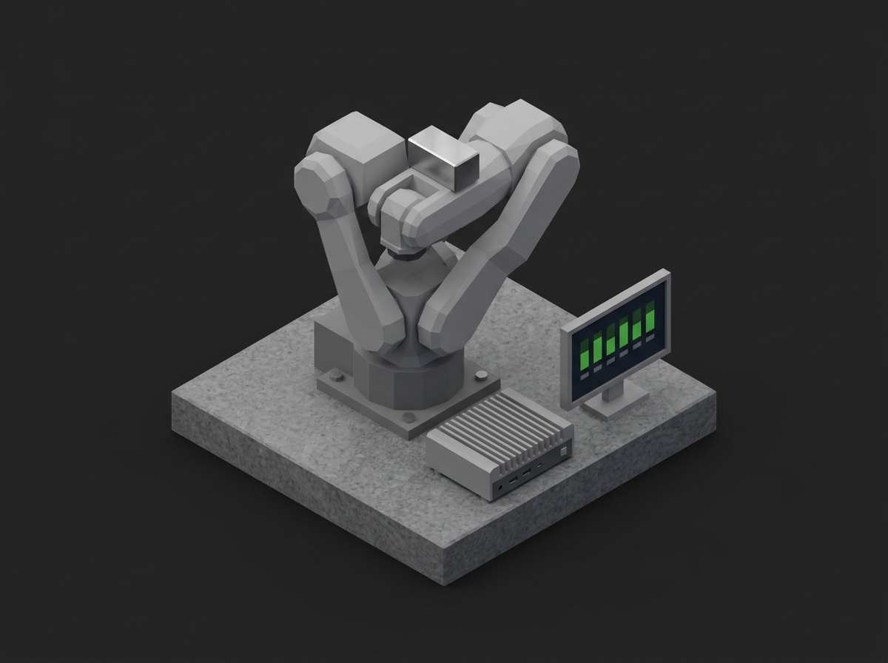

# Framework Joint Encoder Zeroing and Mastering



A TofuPilot Framework procedure for the mastering station of a robot assembly line: the operator badge lands on the run as its operator, the fixture kit is recorded, the safety circuit is checked before any brake releases, each of the six joints is driven onto its witness pin and its encoder offset written, the motor-vs-joint encoder delta is checked against the gearbox's own limit, the whole thing is repeated to measure the procedure's repeatability, the offsets are read back and the mastering file is attached to the run.

## What This Shows

| Feature | Where |
|---------|-------|
| Operator badge bound to `run.operated_by` | `identify_operator` UI in `procedure.yaml`, `operated_by: {}` at root |
| Radio bound to a string measurement validated with `in` | `fixture_kit` |
| Ordered setup stage | `interlocks` depends on `identify_operator` |
| Multi-dimensional measurement with per-axis custom aggregations | `mastering` -- `max_abs_deg` on the offset axis, `worst_vs_limit` on the delta axis |
| JSON measurements as per-joint tables | `offsets`, `remaster_spread` |
| Disabled optional phase | `touch_probe` -- `enabled: false` |
| Attachment built in memory and unit metadata from Python | `phases/verify_written.py` |
| Teardown stage | `brakes_engaged` |

## Get Started

1. Sign up for a free TofuPilot account at [tofupilot.app](https://www.tofupilot.app/auth/signup).
2. Open the **New Procedure** flow in the dashboard and clone this template.
3. Follow the dashboard's instructions to set up a station and run the procedure.

For deeper guides, see the [TofuPilot docs](https://www.tofupilot.com/docs/framework) and the [Joint Encoder Mastering template page](https://www.tofupilot.com/templates/joint-encoder-zeroing-and-mastering).

## Structure

```
.
├── procedure.yaml                    # Procedure, plug, phases, measurements
├── ui.json                           # Pre-baked operator answers
├── phases/
│   ├── interlocks.py                 # Setup: safety circuit, operator on record
│   ├── master_joints.py              # Per joint: pin, read both encoders, write offset
│   ├── repeatability.py              # Remaster and compare
│   ├── touch_probe.py                # Optional finishing pass (disabled)
│   ├── verify_written.py             # Read back, attach mastering file
│   └── brakes_engaged.py             # Teardown
├── plugs/
│   └── robot.py                      # Mock controller service interface
├── utils/
│   └── joints.py                     # Joint table with gearbox limits
├── pyproject.toml                    # uv-managed Python project
└── README.md
```

## Replace the Mock with Real Hardware

`plugs/robot.py` maps to the controller's service API (UR dashboard and RTDE, KUKA Sunrise, ABB RobotWare, FANUC KAREL). Keep the method names and return plain values; the phases, measurements and limits stay the same.
